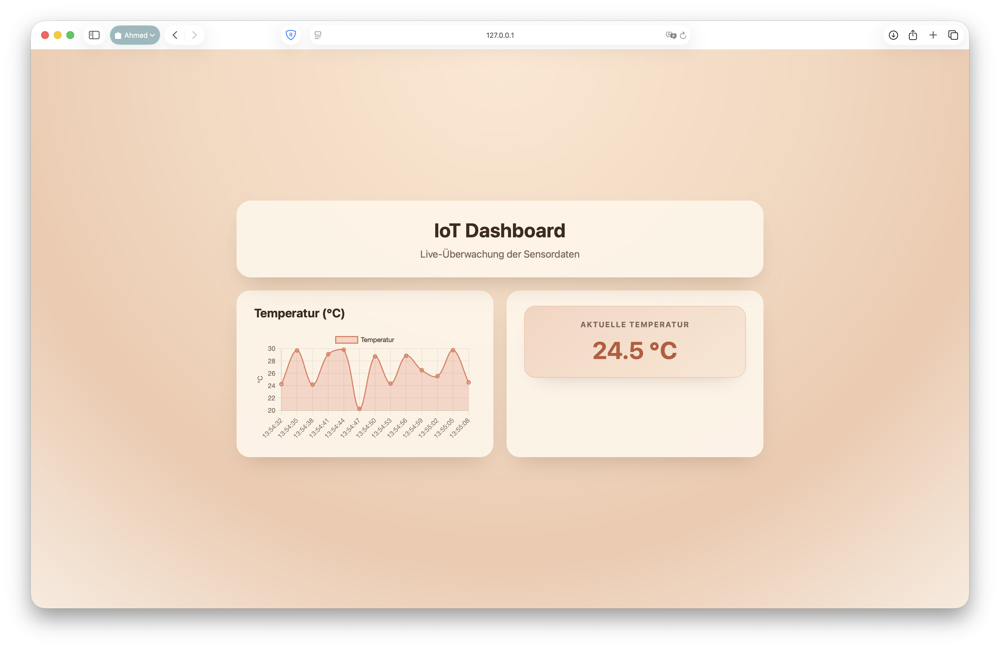

# IoT Dashboard

Ein kompaktes Demo-Projekt aus HTML/CSS/JS und Python (Flask), das zeigt, wie sich ein einfaches IoT-Dashboard realisieren lässt. Der Client pollt das API alle 3 Sekunden, aktualisiert das Chart mit Chart.js und zeigt den aktuellen Temperaturwert an.

## Technologie-Stack
- **Frontend:** `index.html`, `style.css`, `script.js`, Bibliothek [Chart.js](https://www.chartjs.org/) über CDN  
- **Backend:** `app.py` mit Flask, liefert zufällige Temperaturen zwischen 20 °C und 30 °C

## Projekt starten

1. **Virtuelle Umgebung anlegen (optional):**
   ```bash
   python3 -m venv .venv
   source .venv/bin/activate  # macOS / Linux
   .venv\Scripts\activate     # Windows
   ```

2. **Abhängigkeiten installieren:**
   ```bash
   pip install Flask
   ```

3. **Backend starten:**
   ```bash
   python3 app.py
   ```
   Der Server läuft anschließend unter `http://127.0.0.1:5000/data` und liefert JSON nach folgendem Muster:
   ```json
   {"temperature": 24.7}
   ```

4. **Frontend öffnen:**
   - `index.html` im Browser öffnen (Doppelklick oder über einen lokalen Static-Server, z. B. `python3 -m http.server`).
   - Das Dashboard beginnt sofort, das API zu poll­en und den Graphen live zu aktualisieren.

## Projektstruktur
```
.
├── app.py        # Flask-API mit Route /data
├── index.html    # HTML-Grundstruktur des Dashboards
├── style.css     # Styling mit CSS Grid und moderner Farbpalette
├── script.js     # Fetch-Logik und Chart.js-Updates
└── README.md
```

## Hinweise
- Das Projekt ist für den lokalen Einsatz und Demonstrationszwecke gedacht.
- Für einen produktiven Einsatz empfiehlt sich ein WSGI-Server (z. B. Gunicorn, uWSGI) sowie eine sichere CORS-/HTTPS-Konfiguration.

## 📸 Screenshot


